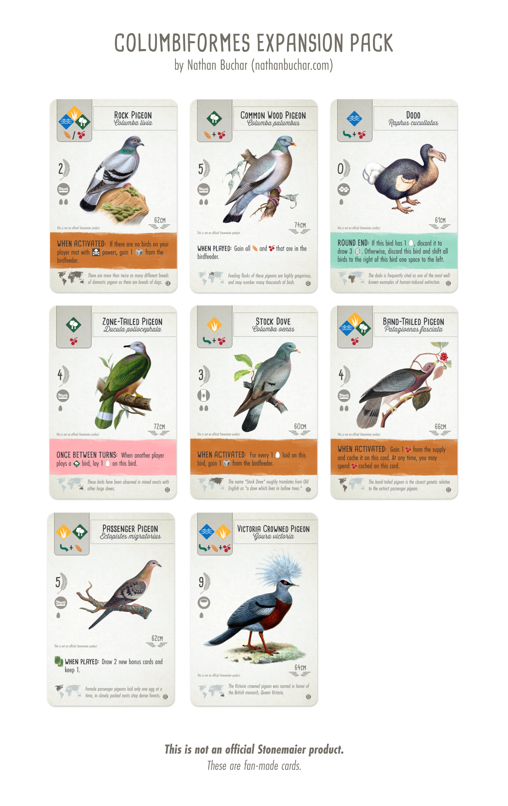

# Columbiformes Expansion Pack for Wingspan

My significant other and I are both bird lovers and huge fans of [Wingspan](https://stonemaiergames.com/games/wingspan), a delightfully nerdy and birdy boardgame designed by Elizabeth Hargrave and produced by Stonemaier Games.

But, like many other Wingspan enthusiasts, we were surprised to discover that the humble [Rock Pigeon](https://en.wikipedia.org/wiki/Rock_dove) is neither included in the game's base card set nor in any of its expansion packs. Wingspan has about 350 unique cards, and yet none of them are for one of the most recognizable birds in the world!

Pigeons are particularly near and dear to our hearts (we have a pet pigeon!), and we love volunteering with [Palomacy](https://pigeonrescue.org), a non-profit dedicated to rescuing and finding homes for pigeons and doves that can't survive on their own. So, I put together an unofficial Columbiformes Expansion Pack which includes—of course—the Rock Pigeon, as well as seven of its columbiform cousins (including the Dodo!).

The Columbiformes Expansion Pack is a fan-made expansion pack for Wingspan consiting of eight new birds from the taxonomic order [_Columbiformes_](https://en.wikipedia.org/wiki/Columbidae).

The art is derived from various antique bird plates and lithographic prints. The art for the band-tailed pigeon is courtesy the Audubon Society of America. If I have used your artwork without permission, I promise it wasn't intentional, please [contact me](mailto:hello@nathanbuchar.com).

These bird cards are provided for free and, per the [Stonemaier Fan Content Policy](https://www.dropbox.com/sh/f2tekc23yvb27w3/AAAVq1zuMLLiaHFwTtUF9Vp3a/Card%20Frames?dl=0&preview=Stonemaier+Fan+Content+Policy+(Read+First).rtf&subfolder_nav_tracking=1), may only be used for personal use. They may not be sold or distributed.

As a thank you, please consider donating to [donating](https://www.pigeonrescue.org/donate/) to Palomacy. Palomacy relies solely on donations and the kindness of volunteers to continue operating (fun fact, our most generous donor is Craig Newmark of Craigslist!). Every dollar goes directly to medical care, food, and supplies for the birds.

To download these bird cards, [click here](https://github.com/nathanbuchar/wingspan-columbiformes-expansion/releases).

## Wingspan Bird Card Development Kit

While I was building my own cards, I also created an unofficial "Bird Card Development Kit", which is a Photoshop file containing all the major elements of Wingspan bird cards. You'll need to buy some fonts though, and they're not cheap.

[Check it out](https://github.com/nathanbuchar/wingspan-bird-card-dev-kit)
