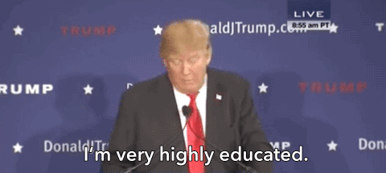

# A Place in the Alphabet
###### Nov 9, 2018

## Background

For the holidays in 2018, Will Shortz, crossword editor at The New York Times, [challenged readers](https://www.nytimes.com/crosswords/alphabet2018) to be part of the NYT's special "Puzzle Mania!" section.

> Dear Puzzler,
>
> This is Will Shortz, crossword editor at The New York Times.
>
> During the past two years, just before Christmas, The Times has published a special section devoted to puzzles called “Puzzle Mania!”
>
> Now we're preparing a new “Puzzle Mania!” section, which will appear on Sunday, Dec. 16, and we'd like to invite you to participate by helping us create a puzzle that will appear in this year's “Puzzle Mania!”

## The Challenge

The challenge was to write a sentence in which the place in the alphabet of the first letter of each word is the same as that word’s length. In other words, if a one-letter word is used, it has to be “a”; a two-letter word has to start with “b”; a three-letter word has to start with “c” etc.

Examples:

- Historic Essen, Germany, digs modernization.
- Georgia highways can be horrible every Friday.
- Interview a daft lexicologist!

## Implementation

I'm a software engineer. I figured it couldn't be too hard to write some code to check if a word is valid. This is what I came up with:

```js
/**
 * Validates a word by checking that its length is equal to
 * the alphabetical position of its fist letter.
 *
 * @param {string} word
 * @returns {boolean}
 */
function checkWord(word) {
  const charCodeOffset = 97;
  const firstLetterCharCode = word.toLowerCase().charCodeAt(0);
  const firstLetterAlphabetPos = firstLetterCharCode - charCodeOffset + 1;

  return firstLetterAlphabetPos === word.length;
}
```

Now I just need words to test. Turns out that a list of most (?) words in the English language are [available on GitHub](https://github.com/dwyl/english-words)! After downloading `words.txt`, I now have a list of English words, but somehow I need to pipe them through my validator. I've worked with [Node.js streams](https://nodejs.org/api/stream.html) before, but this was my first time implementing a _transform_ stream.

The following will pipe `words.txt` as chunks into a custom stream transformer I wrote, validate each word, and then write all valid words to `words_valid.txt`:

```js
const fs = require('fs');
const { Transform } = require('stream');

const filterWords = new Transform({
  transform(chunk, encoding, callback) {
    // Split each line into an array of words.
    const words = chunk.toString().split('\r\n');

    words.forEach((word) => {
      // There are some words in the list that have weird
      // punctuation, like "b-". Let's avoid those.
      if (!/!(\w|\.)/.test(word)) {
        if (checkWord(word)) {
          this.push(word);
          this.push('\n');
        }
      }
    });

    callback();
  }
});

const readable = fs.createReadStream('./words.txt');
const writable = fs.createWriteStream('./words_valid.txt');

readable.pipe(filterWords).pipe(writable);
```

This is great! Now I have a list of words that we can use to try to form sentences for "Puzzle Mania!". Here are a few interesting words my program found:

* puzzleheadedness
* retroconsciousness
* straightforwardness

And the longest valid word:

*  undistinguishableness

And here's the best sentence I came up with:

* Intricate flames glowing magnificently.

It's not bad! I never did end up submitting it, but I did take this one step further: what if I only limited myself to words tweeted by [@realDonaldTrump](https://twitter.com/realdonaldtrump)? He does have the best words after all.




## Trump Tweets

I found a website which compiled all of Mr. Trump's tweets in a consumable format, so I downloaded them and parsed through the file using a similar algorithm to the one above. Since it was in JSON format, however, I didn't need to use transform streams, just a simple `Array.reduce()` sufficed. I also decided to extract all valid at-mentions (@) and hashtags (#), because why not?

```js
const fs = require('fs');
const tweets = require('./trump-tweets');

const words = tweets.reduce((acc, { text }) => {
  // Find all matching words, not including mentions
  // and hashtags. Ignore all words starting with any
  // character other than a-ZA-Z, @, or #.
  const matches = text.match(/\s([a-zA-Z@#]\S*\b)/g);

  if (matches) {
    matches.forEach((match) => {
      // Extract just the word portion of the match (i.e.,
      // strip the @ or # if present).
      const word = match.match(/\w+/)[0];

      // Check that the word is valid and has not already
      // been found.
      if (checkWord(word) && !acc.includes(match)) {
        acc.push(match);
      }
    });
  }

  return acc;
}, []);

words.sort((a, b) => {
  return a.toLowerCase() < b.toLowerCase() ? -1 : 1;
});

fs.writeFileSync('./trump-words.txt', `${words.join('\n')}\n`);
```

In total, I found 2,006 valid "words" (misspellings, abbreviations, hyperbole, etc.), 629 valid mentions, and 82 valid hashtags. In the end, I managed to come up with the following valid sentences:

* hahahaha goodbye @SenatorJeffSessions! #PlayTheTrumpCard
* Fueled by ignorance: #MeetTheTrumps
* DACA favors immigrant interests

From what I discovered—and maybe it's not so much of a surprise—most of Mr. Trump's vocabulary leans pretty negative. I was, however, still able to construct at least one positive sentence:

* A genuine future every family can enjoy #hardwork

So yeah, all in all: pretty fun little project.
