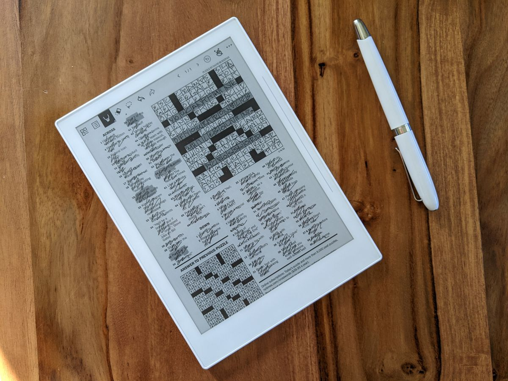

# Automatically upload the daily NYT crossword to a Supernote
###### Dec 21, 2021




## The Problem

> Note: For anyone landing on this page from Google looking to automatically upload the NYT crossword to your Supernote or similar e-ink tablet, I'm afraid this solution requires some knowledge of programming.

> Update 1/12/21: This can be easily adapted to work for the Wall Street Journal crossword as well. Unlike the NYT crossword, the WSJ crossword does not require a paid membership. Scroll down to the bottom of this page for more info.

I (try) to do the New York Times crossword puzzle every day, and this holiday season when I purchased myself a [Ratta Supernote A6X](supernote.com), I was excited about the prospect of doing the crossword using an e-ink tablet rather than clumsily on my phone.

Unfortunately, the e-ink tablet software ecosystem isn't very mature, and I imagine we won't see a native NYT Crossword app for a long time, if ever. Worse, the NYT has a pretty limited API, mostly related to articles and there are no endpoints related to puzzles or games.

For most, the standard solution is to manually download the crossword as a PDF every day, and then sync it to the Supernote using either Dropbox or Supernote Cloud. But I wanted to automate this.

First off, I noticed that the daily crossword PDF download URL is predictable for any given day:

```
https://nytimes.com/svc/crosswords/v2/puzzle/print/{month}{day}{2-digit year}.pdf
```

For today's date, that would look like:

```
https://nytimes.com/.../Dec2121.pdf
```

Unfortunately, these resources are only accessibe to NYT paid subscribers and any request to this URL by any unathenticated or unpaid user will result in an error.

My initial attempt used Selenium to automatically log in and attempt to download the file. Unfortunately, not only did I get flagged as a bot and blocked, I also could not for the life of me determine how to download a PDF file in headless Chrome.

So I changed tack, and realized that maybe I could make a web request directly to the download URL if I spoof my cookies. After all, I _am_ a paying subscriber. I went to nytimes.com, opened the dev tools, and ran `document.cookie`. This spat out a long string of all of my NY Times cookies. I checked the important ones, and it looks like these won't expire for at least one year, meaning at worst I'd only need to manually update them every 356 puzzles. I can live with that.

So I made a test `wget` call:

```
wget --no-verbose --content-disposition "https://www.nytimes.com/svc/crosswords/v2/puzzle/print/Dec2121.pdf"
  --header='Referer: https://www.nytimes.com/crosswords/archive/daily' \
  --header='Cookie: {my nyt cookie}'
```

And it worked!

```
2021-12-21 07:10:21 URL:https://www.nytimes.com/svc/crosswords/v2/puzzle/print/Dec2121.pdf [74658/74658] -> "Dec2121.pdf" [1]
```

So now I just needed turn this into a service. The following is what I came up with.


## The Solution

**Requirements**

1. Syncing enabled between Dropbox and your Supernote device. This won't work if you use Supernote Cloud, sorry!

1. A [Dropbox access token](https://dropbox.tech/developers/generate-an-access-token-for-your-own-account) for your account.

1. A NY Times [puzzle subscription](https://www.nytimes.com/subscription/games).

1. A local or remote server running [Node.js](https://nodejs.org). I use [Heroku](https://heroku.com).

    * Also you'll need to `npm install` both `dropbox` and `moment`.


**Environment Variables**

There are a few environment variables to configure:

* `DROPBOX_ACCESS_TOKEN` - The Dropbox access token for your account. You can generate one [here](https://dropbox.tech/developers/generate-an-access-token-for-your-own-account).

* `NYT_COOKIE` - The result of running `document.cookie` on nytimes.com while logged into your account with a paid puzzles subscription.

* `SUPERNOTE_UPLOAD_PATH` - The path within Dropbox where to upload the crossword PDFs to. Supernote automatically creates its own folder structure on Dropbox, so this worked for me and should work for you too: `/Supernote/Document/Crosswords`. Amend as needed.


**The Code**

```js
/**
 * Schedules a cronjob which will automatically download
 * the NYT daily crossword 1 minute after its published and
 * then upload it to your Dropbox.
 *
 * @author Nathan Buchar <hello@nathanbuchar.com>
 * @license MIT
 */

const cron = require('cron');
const dropbox = require('dropbox');
const https = require('https');
const moment = require('moment');
const path = require('path');

// Instantiate the Dropbox instance.
//
// Set DROPBOX_ACCESS_TOKEN to an access token that you've
// generated for your Dropbox account.
//
// See https://dropbox.tech/developers/generate-an-access-token-for-your-own-account
const dbx = new dropbox.Dropbox({
  accessToken: process.env.DROPBOX_ACCESS_TOKEN,
});

function getNYTCrossword(date) {
  const d = moment(date);

  console.log('Attempting to download crossword...');

  // Get the crossword.
  //
  // Set NYT_COOKIE to the return value of `document.cookie`
  // when logged into your account on nytimes.com. This
  // cookie will eventually expire and need to be set again.
  const req = https.request({
    protocol: 'https:',
    host: 'www.nytimes.com',
    path: `/svc/crosswords/v2/puzzle/print/${d.format('MMMDDYY')}.pdf`,
    method: 'GET',
    headers: {
      Referer: 'https://www.nytimes.com/crosswords/archive/daily',
      Cookie: process.env.NYT_COOKIE,
    },
  }, (res) => {
    if (res.statusCode === 200) {
      const data = [];

      res.on('error', (err) => {
        console.log(err);
      });

      res.on('data', (chunk) => {
        data.push(chunk);
      });

      res.on('end', () => {
        console.log('Successfully downloaded crossword');

        // The file has successfully downloaded. Upload it
        // to Dropbox.
        //
        // Set SUPERNOTE_UPLOAD_PATH to the path where the
        // PDFs should be uploaded on Dropbox. This should
        // look something like "/Supernote/Documents/Crosswords".
        dbx.filesUpload({
          path: path.join(process.env.SUPERNOTE_UPLOAD_PATH, `${d.format('YYYYMMDD_ddd')}-crossword.pdf`),
          contents: Buffer.concat(data),
        }).then((response) => {
          console.log('Successfully uploaded crossword');
          console.log(`Content hash: ${response.result.content_hash}`);
        }).catch((err) => {
          console.log('Error writing to dropbox');
          console.log(err);
        });
      });
    } else {
      console.log(`Could not get crossword. Status code: ${res.statusCode}`);
    }
  });

  req.on('error', (err) => {
    console.log(err);
  });

  req.end();
}

function getTomorrowsNYTCrossword() {
  const today = new Date();
  const todayNYTime = today.toLocaleString('en-US', { timeZone: 'America/New_York' });

  const tomorrow = new Date(todayNYTime);
  tomorrow.setDate(tomorrow.getDate() + 1);

  getNYTCrossword(tomorrow);
}

const weekdayJob = new cron.CronJob({
  cronTime: '1 22 * * 1,2,3,4,5', // Mon-Fri @ 6:01pm ET.
  timeZone: 'America/New_York',
  onTick() {
    getTomorrowsNYTCrossword();
  },
});

const weekendJob = new cron.CronJob({
  cronTime: '1 18 * * 0,6', // Sun,Sat @ 6:01pm ET.
  timeZone: 'America/New_York',
  onTick() {
    getTomorrowsNYTCrossword();
  },
});

weekdayJob.start();
weekendJob.start();
```

If this helped you at all, I'd love to hear about it. If you share this code elsewhere, be sure to give me credit.


## Update 1/12/22

This can be adapted to work for the Wall Street Journal crossword as well. Unlike the NYT crossword, the WSJ crossword does not require a paid membership. To download the WSJ crossword instead, just change the request to:

```js
const req = https.request({
  protocol: 'https:',
  host: 's.wsj.net',
  path: `/public/resources/documents/${d.format('[XWD]MMDDYYYY')}.pdf`, // Ex. XWD12152021.pdf
  method: 'GET',
}, (res) => {
  // ...
});
```

And then update the cron jobs. Note that the WSJ crossword is not always released reliably at a certain time like the NYT crossword, and so it might be best to just schedule the job to run at midnight. There are also no Sunday crosswords.

```js
const jobWSJCrossword = new cron.CronJob({
  cronTime: '0 0 * * 1,2,3,4,5,6', // Mon-Sat @ midnight ET.
  timeZone: 'America/New_York',
  onTick() {
    const today = new Date();
    const todayNYLocaleString = today.toLocaleString('en-US', { timeZone: 'America/New_York' });
    const todayNYDate = new Date(todayNYLocaleString);

    getWSJCrossword(todayNYDate);
  },
});

jobWSJCrossword.start();
```
