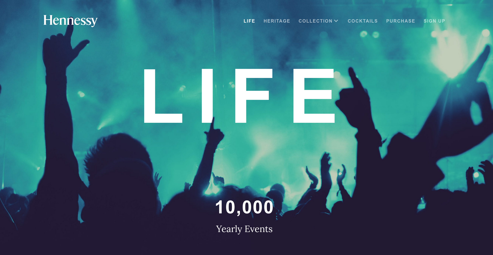
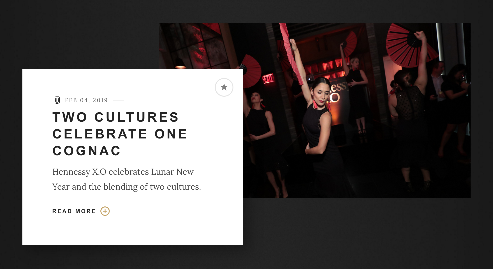
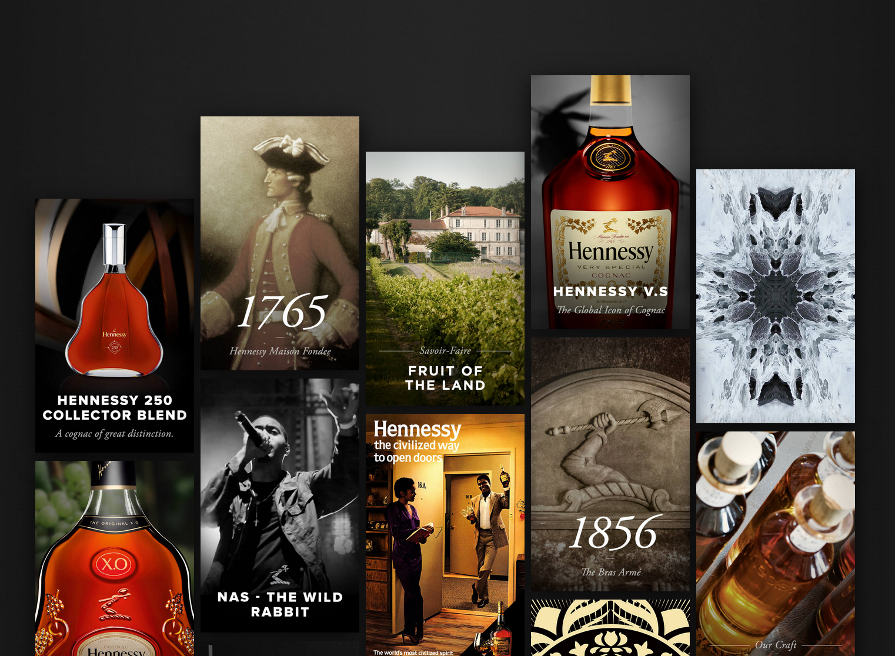
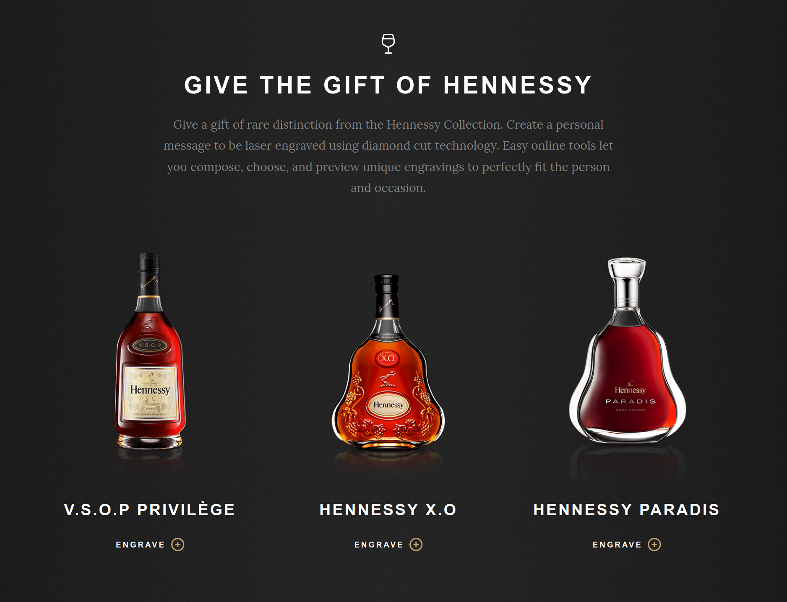

# Hennessy
###### Jan 21, 2020

Over the years, Odopod was the digital partner for a few long-term retainer clients, including the U.S. site for Hennessy Cognac. As the Odopod case study article describes it:

> The new Hennessy.com blends a coveted brand's 250-year heritage with its modern day appeal as a cultural tour de force.

## Notable Projects

During my time at Odopod, Hennessy was the project that I contributed to the most. There are a number of notable projects that I owned and would like to share.

### Life

[The Hennessy Life](hennessy.com/us/life) showcases the brand’s lifestyle through culture, news, events, and influencers. It’s a vibrant, media-rich blend of film, fashion, artist collaborations, hip hop tracks and, of course, cocktails. Content is updated regularly to stay fresh.

The webpage features rich imagery, and subtle card layering through the delicate use of parallaxing.

### Legacy

[The Hennessy Legacy](hennessy.com/us/heritage/legacy) is a collection of moments, people, techniques, and artworks that define Hennessy's 250-year adventure.

The webpage features dynamic card animations in a masonry-style layout.

### Engraver

The Hennessy engraver module, found on the [purchase](hennessy.com/us/purchase/) page was one of my first hefty projects on Hennessy.

Before purchasing, customers can choose to engrave their bottle, which launched the engraving experience in a full-screen modal.

