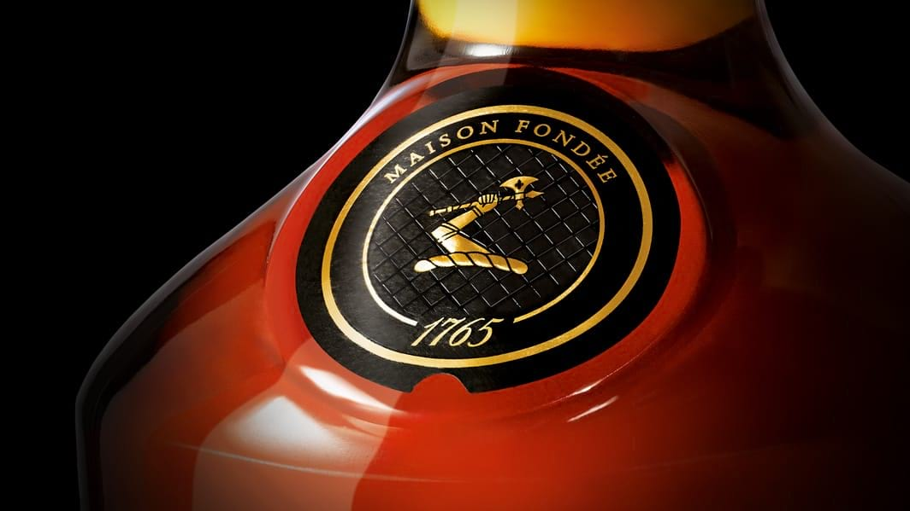
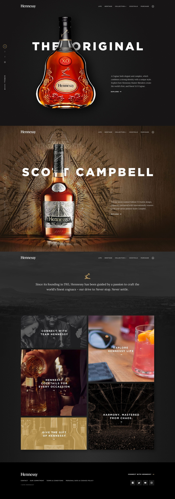
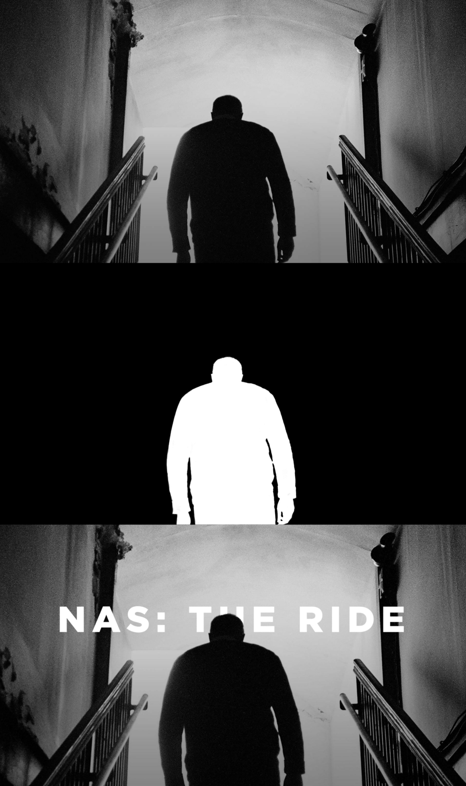
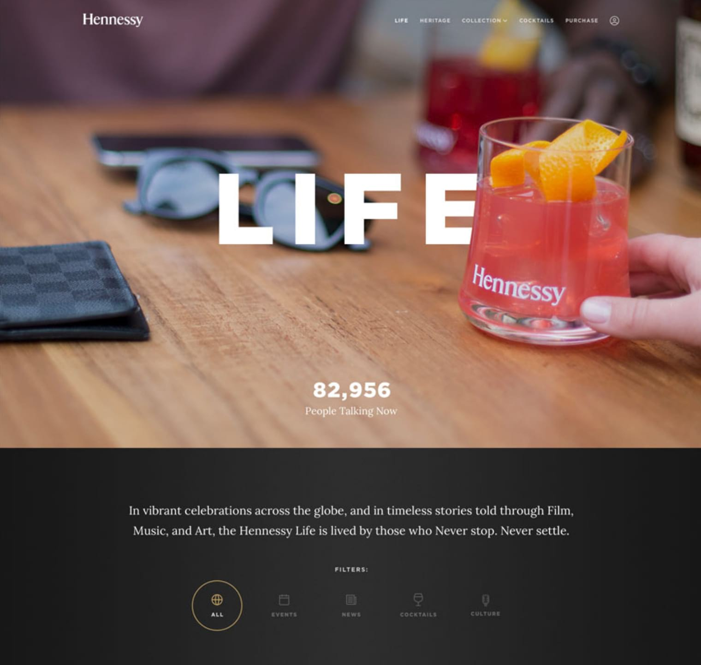
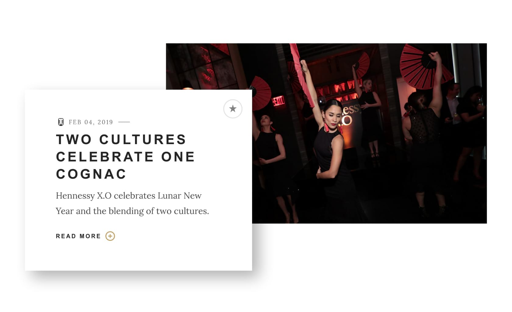
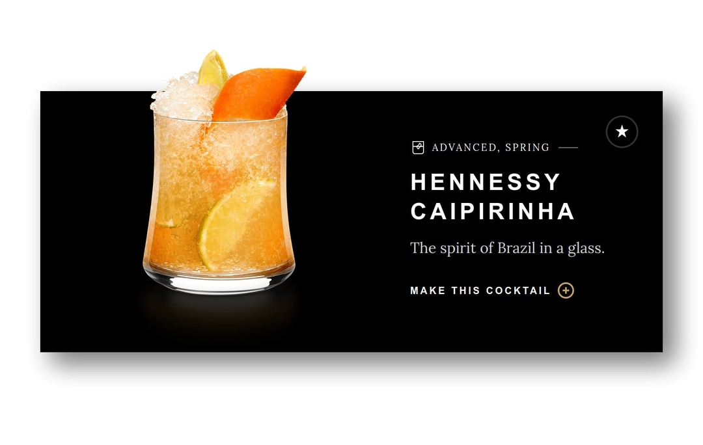
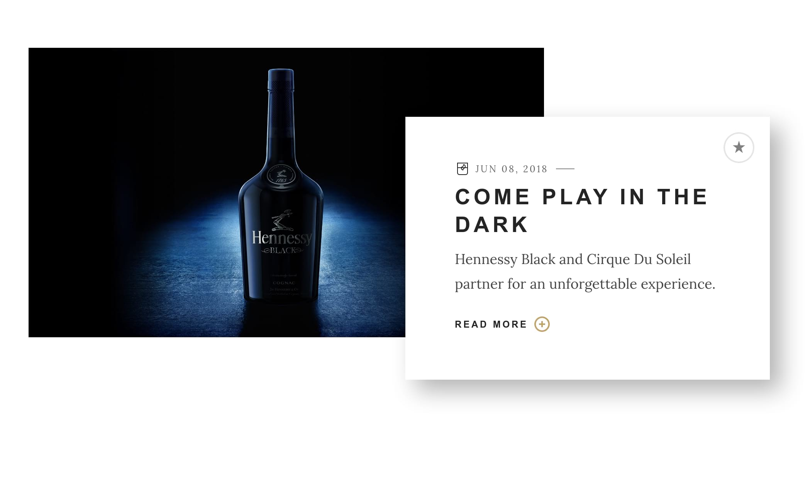
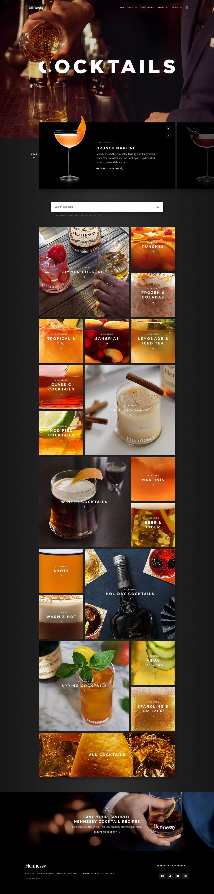
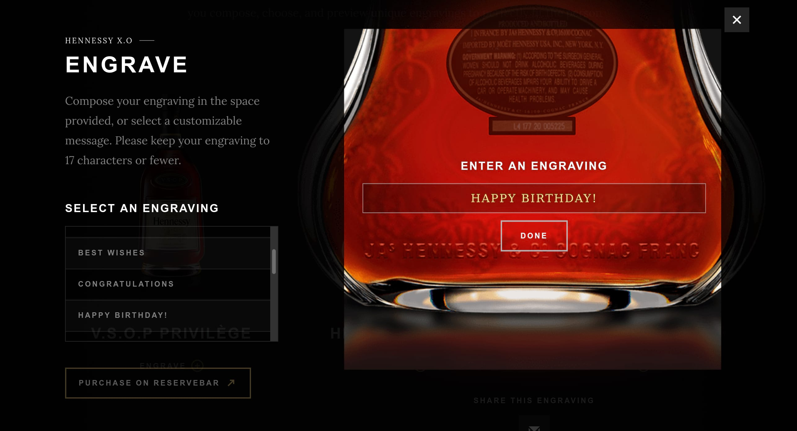

# Hennessy
###### Jan 21, 2020

Odopod, a digital agency I spent a few years at after college, has been the digital partner for the U.S. website for Hennessy Cognac since 2012. The site went through a major revamp in 2017, focusing on speed, stability, and visual design. As the case study from Odopod.com puts it:

> The new Hennessy.com blends a coveted brand's 250-year heritage with its modern day appeal as a cultural tour de force.

## Notable Projects

During my time at Odopod, Hennessy was the project that I contributed to the most. There are a number of notable projects over the course of its lifetime that I owned and would like to share.

### Homepage

I helped rebuild Hennessy's homepage from the ground up. The new homepage features large, full-screen imagery where the text magically appears to live among the content of the image, even though in reality it's a layer on top.

This dynamic text layering was a challenge that I had to solve, and was eventually accomplished by the use of [CSS alpha masks](https://developer.mozilla.org/en-US/docs/Web/CSS/mask) generated from the imagery below and applied over top of the text containers. This entirely unique concept added life and dimension to what would ordinarily be static content.

There were a couple of reasons we decided to not bake the text right into the image itself:

For one, we wanted our content creators to be able to upload images without having to go through the process of having the copy set into the image, so that it could be emended on the fly if need-be without having to jump through hoops to re-generate the images.

It was also important to us that the text have the ability move and scale with the image. If the text was baked in, then the hero image it would only be able to scale proportional to its original dimensions. This was a dealbreaker, as we wanted the imagery to fill the entire screen no matter the ratio without sacrificing text size and readability.

Below you can see an example of how the alpha masks were generated.

### Life

[The Hennessy Life](https://www.hennessy.com/us/life) showcases the brand’s lifestyle through culture, news, events, and influencers. It’s a vibrant, media-rich blend of film, fashion, artist collaborations, hip hop tracks and, of course, cocktails. Content is updated regularly to stay fresh.

The webpage features rich, curated imagery with hints of depth accomplished via the delicate use of vertical parallaxing and scaling.

### Cocktails

In a similar vein to the homepage, the hero image on the Cocktails landing page also implements a masking layer over top of the text. A major feature of this page is the search bar, which aggregates data from cocktail names, ingredients, or collections.

### Engraver

The Hennessy engraver module, found on the [purchase](https://www.hennessy.com/us/purchase/) page was one of my first hefty projects on Hennessy.

Before purchasing, customers can choose to engrave their bottle, which launched the engraving experience in a full-screen modal.

