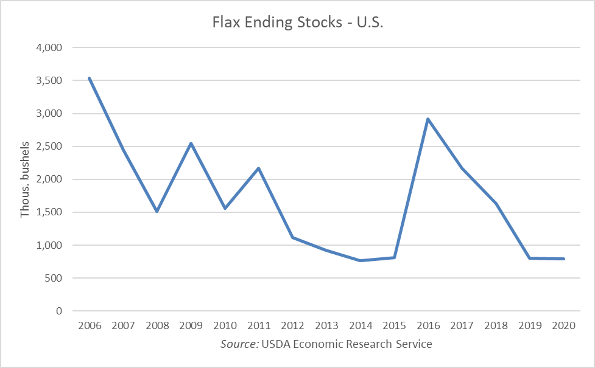

# How Much Flax Seed Could $150k Buy?
###### Jan 24, 2020

So some mornings before I catch my bus to work, I apologize to my bird while I'm getting her set up in her cage that I have to leave and that I'll be spending the whole day picking flax for her to eat. Oh, flax seed is Sophia's favorite food by the way—brown flax that is, not that golden shit.

It's a silly little joke: Claiming that I'm spending all my time, energy, and income on buying seeds for a bird who eats less than two tablespoons per day.

But yesterday afternoon I thought to myself: **how much flax seed could I actually buy on a year's salary?**

## Retail

Well, there's a retail store in Noe Valley that sells brown flax seed at $1.99 per lb. That's usually where I get my flax seed from. Assuming I have an annual salary of $150k (I don't), that works out to roughly **68,392 lbs** of flax. About 34.2 tons! That's a lot of flax. Not accounting for tax, obviously (flax tax?).

I want to visualize that. How much flax is 34.2 tons exactly? Well, it seems that a tandem axle dump truck can typically haul 15 to 20 cubic yards, and anywhere between 12 and 16 tons of payload, dependent on truck specifications and local laws^[https://www.answers.com/Q/What_is_the_average_VOLUME_of_dump_truck]. That's a good place to start. Looking up the number of lbs of flax seed per cubic yard, I find it to be 854.93 lbs/yd^3^^[https://www.aqua-calc.com/page/density-table/substance/whole-blank-flax-blank-seed-coma-and-blank-upc-column--blank-078742141602].

Doing a little math, that means 68,392 lbs of flax is almost exactly 80 cubic yards, and if each dump truck can hold, say, 16 cubic yards of material, then it follows that I'd need exactly **five full dump trucks** to haul it all. And in case you were wondering, I did double check: the dump trucks would _not_ be over their recommended weight capacity.

But how long would all that seed last my little Sophia? If I go with 2tbsp per day, that works out to roughly 1,709,800 days, or 4,681 years. That also means that I could instead feed 1,709,800 pigeons in a single day. According to OvoControl, a company that develops a humane bird feed that is essentially pigeon birth control to help combat overpopulation (I love pigeons, but it is a problem and only results in a lot of unnecessary deaths), the number of feral pigeons in New York City exceeds one million^[https://www.ovocontrol.com/pigeon-facts-figures]. So, with that much seed, I could reasonably feed **every single feral pigeon in New York City** for a day, and maybe still have some left over.

## Wholesale

But let's be real. If I were serious about this, I would be _crazy_ to pay retail price for that much seed. If I were smart I'd go through an industrial supplier or wholesaler—that's the _not_ crazy thing to do. And I'm not crazy.

So at around 7pm on a Friday night, I found myself searching "industrial suppliers brown flax" on Google. I eventually discovered the website for the [Flax Council of Canada](https://flaxcouncil.ca/) where they have a list of something like ten industrial flax suppliers. It's Canadian, but eh I'm sure it's fine.

Oh, as an aside, I should mention that while I was searching for industrial suppliers, I did find a website selling 50lb bags of brown flax seed for horses, but they were $124.95 a bag! That's 25% more expensive per pound than my shop in the city. What a scam. To be fair, they did have a deal that if you buy two bags you get $30 off your total, but it's still a no-go.

### Flax: Past, Present, and Future (Abridged)

While I was on the Flax Council's website, I also read about the rich and storied history of flax. Did you know that flax (L. usitatissimum) has been grown since the beginnings of civilization and that people all over the world have celebrated it's usefulness throughout the ages? Boy I sure didn't. Also, as we "head into the new millennium" (when was this site last updated?), new markets for flax are—apparently—soaring worldwide.

Hold up. Assuming the copy for this website was last updated in something like the early 2000's, has flax actually been a sound commodity to invest in? Boy I'm out of my depth here. Flax doesn't just have its own stock symbol right? How does one find 20-year historical performance on commodity crops exactly?

After some Googling, I found at least a little information, and it seems that 2016 was a great fucking year for flax. Dang, Bitcoin be damned, maybe I should have invested in flax instead. I did manage to find the following chart on the website for [AmeriFlax](https://www.ameriflax.com/), a trade organization that represents North Dakota flax producers. It goes back to 2006:

Flax stocks are apparently the lowest they've been in 15 years. According to the website, the unusually wet fall in North Dakota and an early-season snowstorm caused heavy damage to the flax crop^[https://www.ameriflax.com/#yui_3_17_2_1_1579928642455_1493]. This is great news for me (I think?), as someone looking to buy it in large quantities. Well, in theory.

### To whom it may concern,

Anyway, I chose the first flax supplier on the list, because I'm not exactly an expert in comparison shopping industrial suppliers of ancient grains and seeds. It was a company headquartered in Chicago named [Archer Daniels Midland Company](https://www.adm.com/) (ADM). I guess they won because they were fortunate enough to have a name starting with the letter A. They seemed pretty legit, so I was poking around their site hoping to find anything on prices for bulk quantities of brown flax seed, but of course it wasn't listed. I did, however, find a handy "Contact us" button...

> To whom it may concern,

My message is mostly just a retelling of everything described above but in a little less detail, so I've omitted it for brevity's sake. At the end of the message, I posed the question:

> So I was wondering: how much ADM brown flax seed could $150k USD buy?
>
> Thanks!

I proved to Google that I wasn't a robot, sent the message, and began waiting anxiously for a reply. While I was at it, I also sent an email to the second supplier in the list: [CanMar Foods](https://canmarfoods.com/) (I guess maybe I am comparison shopping now). For what it's worth, they had a pretty baller logo and their website was a lot more inviting; they even had this tagline on their wholesale inquiry page:

> Your 𝒻𝓁𝒶𝓍 needs. Made to Order.

How could I not?

***

At the moment, I'm still waiting on a reply from one of the two suppliers I reached out to.
