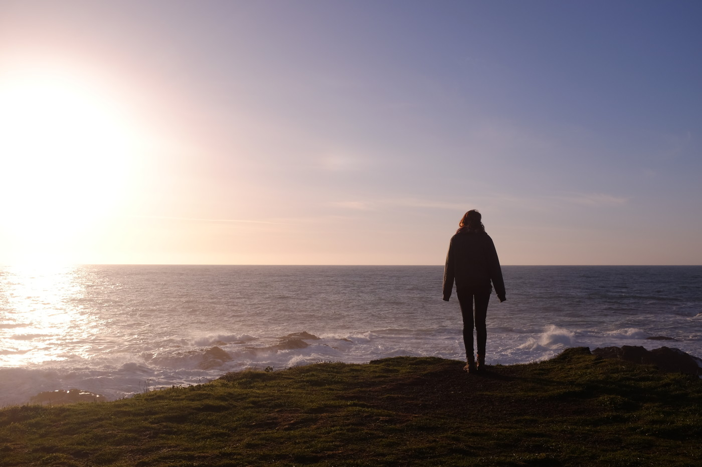
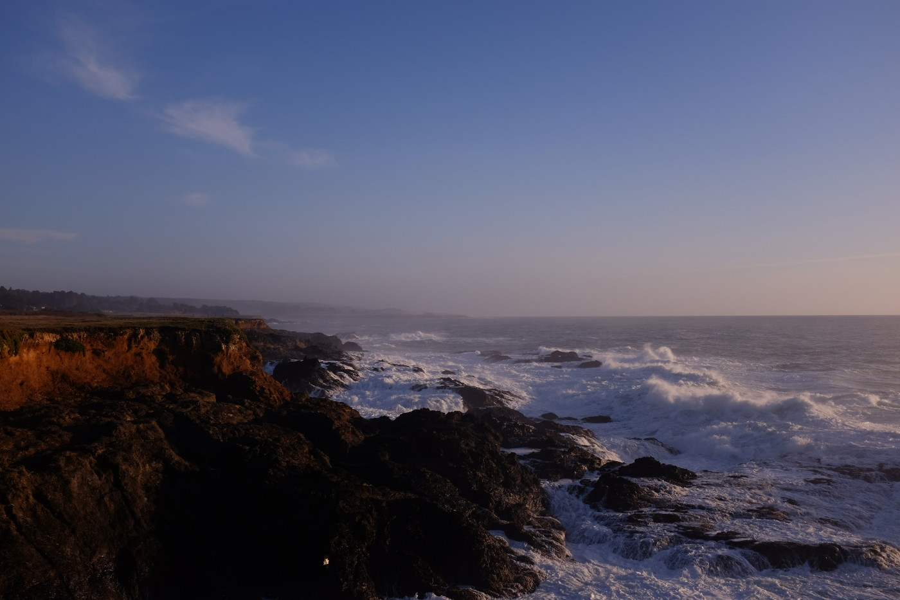

# Responsive Images
###### Jan 18, 2020

 

I started working with [responsive images](https://developer.mozilla.org/en-US/docs/Learn/HTML/Multimedia_and_embedding/Responsive_images) in 2015, but haven't messed with them much lately. This is a re-exploration into responsive images using `picture` and `srcset` with some photos of mine taken at Pt. Cabrillo, California in 2018.

<picture>
  
</picture>

<picture>
  
</picture>
