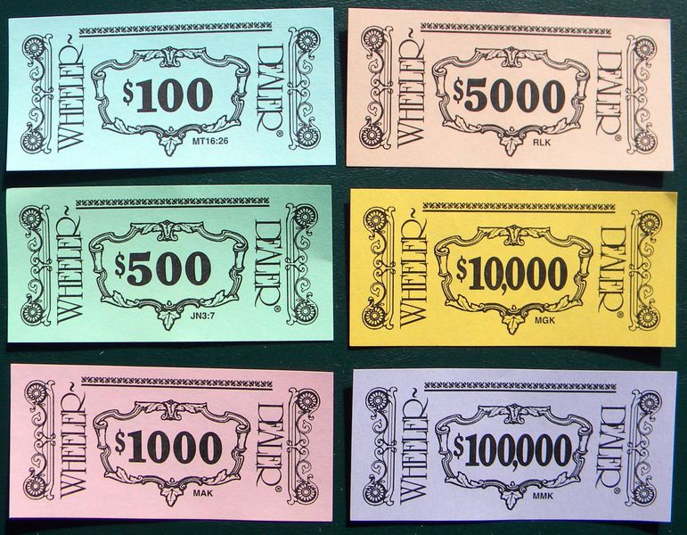

# The math of Wheeler-Dealer
###### May 9, 2020

## Abstract

In this post I briefly explore the history of one of my favorite games: Wheeler-Dealer (a Monopoly-style board game), an overview of how the game is played, how I first discovered the game, and then deep dive into how to best strategically optimize one's investments on the Commodity Futures Exchange using math and probability.

Please note that any gameplay tips I make in this post may not --- and likely won't --- suit most versions of Wheeler-Dealer, as each production is completely unique and older variants have drastically different investment rules, returns, and profit odds.

## History

Wheeler-Dealer is a Monopoly-style game (but notably _not_ Monopoly) produced by Michael Glenn Productions that was marketed in local areas during the 1980's and 90's. It was personalized for each area with the names of local businesses and retailers who contributed to help cover the cost to license and produce the game in exchange for having their names forever immortalized on the game board.

Each production of the game was sold in its respective namesake city using the city's name in the title, typically in the format _The Game of \_\_\_\_\_\__. Like _The Game of Houston_, for example. Earlier productions of Wheeler-Dealer often applied the _-Opoly_ suffix to the end of the name of the city: _The Game of Abbey-Opoly_^[https://boardgamegeek.com/image/191084/wheeler-dealer], to name one.

From my research I've found that most productions of the game were not packaged in a customized box. Instead, all of the pieces, papers, game board, and other miscellanea were placed in just the generic lower half of a box then sealed with shrink-wrap. This makes the games that _did_ come in customized boxes particularly desirable, as most still contain all of the original pieces. Furthermore, the branding on the boxes were usually very minimal and often quite lovely, as was the case with _The Game of Pacifica_^[https://boardgamegeek.com/image/191084/wheeler-dealer] shown below --- a variant of the game I'm eager to get my hands on.

*<small>via Chris Romero (@Vectrexer), boardgamegeek.com.</small>*

Although Wheeler-Dealer hasn't been produced for decades, games for cities from all over the United States can be found available online for sale on Ebay or Etsy. A quick search right now on Ebay yields 63 results^[https://www.ebay.com/sch/i.html?&_nkw=wheeler+dealer&_sacat=2550]: _The Game of Hermiston_, _The Game of Oak Grove_, _The Game of New Haven_, _The Game of Santa Fe_, _The Game of Oakwood_... just to name a few.

## Gameplay

Similar to Monopoly, the game features a number of property blocks and special tiles situated around the perimeter of the game board that players can purchase with money they've earned throughout the game. The goal of the game is to either bankrupt your opponents, or finish with the highest total net worth.

However, unlike Monopoly, Wheeler-Dealer has no system of house or hotel ownership. There are also no railroads, no Chance cards, no Community Chest, no utilities, no Free Parking, no Jail, no passing Go and no collecting $200. Wheeler-Dealer has its own unique set of rules, cards, and gameplay which make the game --- although very similar to Monopoly --- entirely unique, and admittedly a lot of fun (except of course if you draw a Tax Audit card).

*<small>via Chris Romero (@Vectrexer), boardgamegeek.com.</small>*

Players begin each turn by first investing in the Commodity Futures Exchange --- kind of like a mini stock market --- where they must invest a set amount of money into one of twelve commodities, like Eggs, Wheat, Pork Bellies, Platinum, etc. Every commodity has a set  probability that a player will turn a profit (called the "profit odds") when investing in it.

After the player has chosen a commodity to invest in, they roll the dice and either win and receive a return on their investment, or they lose their investment entirely. For example, copper requires an investment of $20,000, and as long as the player doesn't roll a seven (a 5 in 6 chance), they will be payed $30,000 by the Bank (an extra $10,000 on top of their initial investment).

After investing in the Commodity Futures Exchange, the player then rolls the dice to move their token. If the property the the player lands on is unowned, then they can either buy the property from the Bank or leave the property up for auction. If the property is owned and not debt-ridden, then the player rolls to determine how much rent they must pay the owner. If however the property _is_ debt-ridden (which is when the owner leverages the property to take a loan out from the Bank), then the player can poach it from the owner by paying its loan value to the Bank, and there's nothing the previous owner can do about it.

At the end of each turn, players draw a Wheeler-Dealer card from the deck and must follow the instructions on the card. Some cards even force the player into an IRS Tax Audit, which give them a 50-50 chance of either winning between $10,000 and $60,000, or disastrously having to pay it to the Bank instead.

*<small>via Jeremy Wedel (@jwedel), boardgamegeek.com.</small>*

If players have held on to one or more Wheeler-Dealer cards from previous turns (not all cards are required to be played immediately), they have the option to play just one additional Wheeler-Dealer card before ending their turn.

The game only lasts about 50 turns, because the game ends after the player who drew the last of 50 Wheeler-Dealer cards finishes their turn. This simple concept adds a nice limit to the game, and games can easily be shortened by just removing Wheeler-Dealer cards from the deck --- this also adds an extra bit of mystery, as no one knows which Wheeler-Dealer cards have been removed.

At the end of the game, the winner is determined by total net worth, which is the sum of their property value and all their cash on hand, minus any debts owed to the Bank. Many games don't have a clear winner, making the final tally a nerve-wracking experience.

## The Game of Alameda

I discovered Wheeler-Dealer when I visited my city's local museum in 2018. When I was there, the museum was pretty much just a few disorganized rooms filled with chairs and a scattered artifacts resting on shelves and tables, but something in the corner caught my eye: a large faded white box atop a dresser. As I approached, I could make out the words on the top of the box. _The Game of Alameda_.

The box did not contain any other useful imagery to indicate what the game actually was about or how to play it... only some branding, the seal and flag of the City of Alameda, and a few sponsored logos and attributions. And of course the whole thing was shrink-wrapped in plastic, so it wasn't even possible to open it up to see what was inside, only adding to the mystery.

There was one other thing though: a tiny white price tag stuck to the box --- the kind you might see at a garage sale. It was 99¢.

_The Game of Alameda_, like other variants of Wheeler-Dealer, is a personalized version of the board game Wheeler-Dealer unique to the City of Alameda. Like all productions of Wheeler-Dealer, the properties you can land on and purchase are those of local business and retailers that donated to help have the game produced, like Sunny Beans Coffee Co., Sailnetics Computers, and John S. Towata Flowers. By the way, now that it's been 22 years since this game was produced, most of the businesses on the game board are no longer around, but there are a few!

I opened the game as soon as I got home and got to learning it with my significant other who was living with me at the time. Initially very skeptical of a cheap, Monopoly-style game whose seemingly sole purpose was to advertise local businesses, we ended up actually really loving it.

The game mechanics, although similar in concept to Monopoly, were totally unique and a lot of fun to learn and manipulate. We very quickly fell in love playing the game, and we even brought it with us to her family's Christmas dinner one year for the whole family to join. _The Game of Alameda_ was just always that solid game we'd always go back to when we couldn't think of anything else to play.

It goes without saying that the game also tested our fortitude as a couple. Both of us, very competitive by nature, sometimes found ourselves emotionally exhausted by the end of each game. We'd claw at the loss of a high-valued property at the hands of an "Underhanded Double-dealing Bamboozle!", and then jump with joy at the unlikely win of a hail-mary investment into Peppermint to avoid almost certain bankruptcy.

And in the end, we also argued about who would get to keep _The Game of Alameda_ after we split up (spoiler: I did).

## The Commodity Futures Exchange

The Commodity Futures Exchange is a really unique game concept. To recap from earlier, at the start of each turn each player must invest their money into one of twelve commodities. After rolling the dice, they will either turn a profit on their investment, or lose the investment entirely.

*<small>via David Patterson (@Davidsp145), boardgamegeek.com.</small>*

Interestingly, in earlier productions of the game, there were no compulsory investments for any commodity, only a maximum allowable investment. Returns on commodities were not a set amount either, but rather determined by a payoff multiple which ranged somewhere between 1.2x and 30x depending on the commodity. These earlier productions arguably had a significantly more complex Commodity Futures Exchange than the one you see in later versions --- some games were even packaged with cheat-sheet cards to help players determine what they've won.

You might notice that some commodities are riskier than others. Peppermint is a great example of this; like Copper it requires a $20,000 investment, however the odds of profiting are only 1 in 9. But if luck's on the player's side and they roll a 2, 11, or 12, they win and they'll receive a payout from the Bank in the amount of $400,000!

The game rules also allows players facing certain bankruptcy to make a last-ditch, hail-Mary investment on the Exchange. If the player manages to procure at least $20,000 in capital, they may make a one-time investment on the Commodity Futures Exchange for a chance at winning big and being able to settle their debts without having to resign from the game.

*<small>via Chris Hansen (@chansen2794), boardgamegeek.com.</small>*

The Commodity Futures Exchange is really quite an interesting game mechanic. It's hard to really say if it even adds anything to the game --- the profit odds are always constant, so there's bound to be certain commodities that are just simply always going to be better than others, so if all players invest in the same commodity, they all have the same odds of profiting. It's likely that the Exchange was a hold-over from earlier productions of the games where, in those versions, there were a lot more variables at play making the Exchange far less predictable.

Despite this, it does add some spice to the game: not only does it allow players to accumulate more capital to invest in property or pay debts (if you make smart investments), it can also be devastating at times and can very quickly ruin a player if they're acting carelessly. A couple of bad early-game investments can very easily lead to a loss later in the game.

#### Investing smarter

Wanting to optimize my gameplay as best I can, I was curious as to which commodity or commodities offered the best average return on investment for any given turn.

This particular question led me down quite a rabbit hole, but I started with doing just a little bit of math and constructed the following equation.

$$
\mu = \Big[P_\text{win} \times (R - I)\Big] - \Big[(1 - P_\text{win}) \times I\Big]
$$

Where

$$
\begin{array}{ll}
  \mu &= \text{The average profit per turn,}\\
  P_\text{win} &= \text{The investment's profit odds,}\\
  R &= \text{The investment's total return,}\\
  I &= \text{The amount a player must invest}
\end{array}
$$

It's pretty simple really: it's just how much money the player would expect to win on average subtracted by how much money the player would expect to lose on average.

Just as an exercise, let's use the Commodity Futures Exchange table a few paragraphs up and plug in the variables for Diamonds into the equation in order to calculate its average return on investment $\mu_{\text{d}}$ per turn.

$$
\begin{array}{ll}
\mu_{\text{d}} &= \bigg[\frac{3}{4} \times (\$100\text{k} - \$50\text{k})\bigg] - \bigg[\Big(1 - \frac{3}{4}\Big) \times \$50\text{k}\bigg]\\\\
&= \bigg[\frac{3}{4} \times \$50\text{k}\bigg] - \bigg[\frac{1}{4} \times \$50\text{k}\bigg]\\\\
&= \frac{\$150\text{k}}{4} - \frac{\$50\text{k}}{4}\\\\
&= \frac{\$150\text{k} - \$50\text{k}}{4}\\\\
&= \frac{\$100\text{k}}{4}\\\\
&= \$25\text{k}
\end{array}
$$

After working it out, we find $\mu_{\text{d}}$ to be $25,000. This means that on average, players should expect to profit $25,000 per turn when investing in Diamonds. That's a pretty respectable average rate of return, but the question is: is it the best option out there? What's the most statistically profitable commodity to invest in? Calculating $\mu$ for all other eleven commodities, we find the following.

$$
\begin{array}{l|r}
  \text{Eggs} & \$10,000\\
  \text{Wheat} & \$5,556\\
  \text{Cattle} & \$12,222\\
  \text{Pork Bellies} & \$33,333\\
  \text{Copper} & \$5,000\\
  \text{Gold} & \$16,667\\
  \text{Platinum} & \$50,000\\
  \text{Diamonds} & \$25,000\\
  \text{Bean Sprouts} & \$13,333\\
  \text{Strawberries} & \$50,000\\
  \text{Ebony} & \$20,000\\
  \text{Peppermint} & \$24,444
\end{array}
$$

You'll notice that **Platinum** and **Strawberries** both have the highest average profit per turn at $50,000. Without question these two commodities are the most consistent and reliable money makers, but, interestingly, although these two commodities share the same average profit per turn, they have no other variable in common --- they just both happened to end up resulting in the same average profit. So... which one is better? Are either fair game? Or are there any subtle differences that make one more desirable than the other? Time to think about volatility.

Some commodities are riskier than others. Eggs, with it's steep $100,000 investment, only yields $20,000, but it's an incredibly safe investment having the highest profit odds of any other commodity at 11 in 12 (~92%). Peppermint on the other hand has a much smaller investment of $20,000, but yields a massive $400,000 return if the player's investment is successful. However, the player only has a 1 in 9 (~11%) chance of success. Given these data, it's easy to come to the conclusion that Peppermint is a riskier or more volatile investment than Eggs --- although you don't have to invest very much, most of the time you lose... but if you do win, you win big.

Sure, the difference in volatility between two extremes on the Exchange is easy to grasp. But how exactly can we measure more subtle risk, like that of Platinum versus Strawberries? Somehow we need to calculate the percentage of players who'd expect to be "in the money" for any given investment. Sure, Platinum and Strawberries both return $50,000 on average, but is one more likely to turn a profit than the other? Sounds like the kind of thing a cumulative distribution function^[https://en.wikipedia.org/wiki/Cumulative_distribution_function] might help us solve. Before we can go that far, we first need to calculate the standard deviation of the expected profit for each commodity.

To calculate the standard deviation $\sigma$ for each turn for a given commodity, we can use the following equation.

$$
\sigma = \sqrt{\Big[P_\text{win}(R - I - \mu)^{2}\Big] + \Big[(1 - P_\text{win})(-I - \mu)^{2}\Big]}
$$

Using the equation above, we find the following approximate standard deviations for each commodity's average profit.

$$
\begin{array}{l|rl}
  \text{Eggs} & \$33,166\\
  \text{Wheat} & \$12,571\\
  \text{Cattle} & \$21,999\\
  \text{Pork Bellies} & \$47,140\\
  \text{Copper} & \$11,180\\
  \text{Gold} & \$29,814\\
  \text{Platinum} & \$67,082 & \longleftarrow\\
  \text{Diamonds} & \$43,301\\
  \text{Bean Sprouts} & \$23,570\\
  \text{Strawberries} & \$70,711 & \longleftarrow\\
  \text{Ebony} & \$86,603\\
  \text{Peppermint} & \$125,708
\end{array}
$$

Looking again to Platinum and Strawberries, we now find that they have slightly different standard deviations. What exactly do these numbers mean though?

Basically: **the middle 68% of players can expect their profit to fall within one standard deviation above or below the average for any given turn.** This means that, for any given turn, 68% players who invest in Platinum would expect a profit (or loss) of between -$17,082 (16th percentile) and $117,0823 (68th percentile), whereas those who invest in Strawberries would expect a return of between -$20,711 and $120,711.

Now that we've found the standard deviation for each commodity, what we want to find is the percentage of players who can expect their profit for any given turn to be greater than $0. To do this, we'll use the cumulative distribution function and evaluate it at $x = 0$.

The cumulative distribution function is notoriously difficult to solve, as it does not have any elementary derivative. That's well beyond my familiarity with math, so I just used the `NORMDIST` function in Google Sheets^[https://support.google.com/docs/answer/3094021] to solve for each commodity.

$$
\begin{array}{l|lll}
  \text{Eggs} & 0.3815\ldots & \Rightarrow 38.15\\
  \text{Wheat} & 0.3293 & \Rightarrow 32.93\\
  \text{Cattle} & 0.2892 & \Rightarrow 28.92\\
  \text{Pork Bellies} & 0.2398 & \Rightarrow 23.98\\
  \text{Copper} & 0.3274 & \Rightarrow 32.74\\
  \text{Gold} & 0.2881 & \Rightarrow 28.81\\
  \text{Platinum} & 0.2280 & \Rightarrow 22.80 & \longleftarrow\\
  \text{Diamonds} & 0.2819 & \Rightarrow 28.19\\
  \text{Bean Sprouts} & 0.2858 & \Rightarrow 28.58\\
  \text{Strawberries} & 0.2398 & \Rightarrow 23.98 & \longleftarrow\\
  \text{Ebony} & 0.4087 & \Rightarrow 40.87\\
  \text{Peppermint} & 0.4229 & \Rightarrow 42.29
\end{array}
$$

We see that the percentile of players who'd expect their average profit per turn when investing in Platinum to be greater than $0 is 22.80. Compare this to 23.98, which is the percentile of players who'd expect their average profit per turn when investing in Strawberries to be greater than $0. **This means that, on average, of the players who invest in _Platinum_ rather than Strawberries, _1.18%_ more of them should expect the profit on their investment to be greater than $0 for any given turn.**

## Final thoughts

Wheeler-Dealer is really quite a fun and profoundly interesting game, and I've made many memories with many friends playing it. People always act a bit aloof at first when they hear that it's similar to Monopoly, but warm up pretty quick once things get rolling.

At the moment, I'm hoping to grow my budding collection of Wheeler-Dealers from different cities --- my most recent addition at the time of this writing is _The Game of Sedona_! Currently sitting at the top of my wishlist are The Games of Rochester (my hometown), and Pacifica (as featured in this post). I actually found _The Game of Rochester_ for sale on Ebay years ago not long after I purchased _The Game of Alameda_, so another will pop up again sometime soon.

If you do happen to come across the Wheeler-Dealer for your city at the local City Hall, museum, library, or wherever it may be, I'd really recommend the investment (no pun intended).
