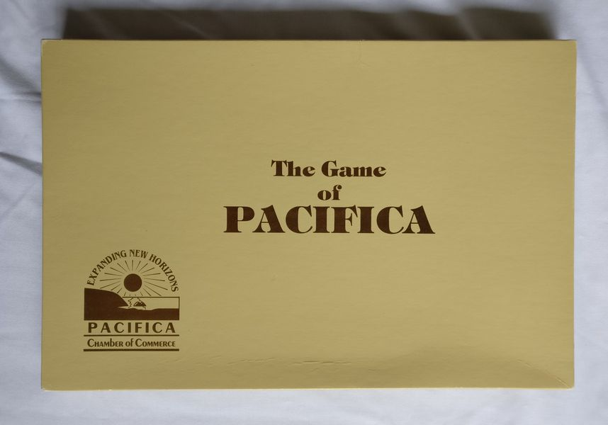
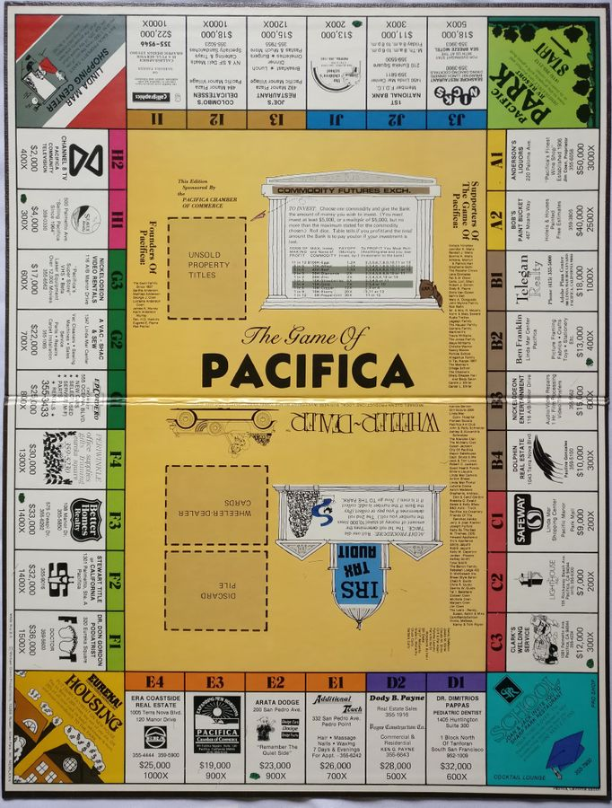
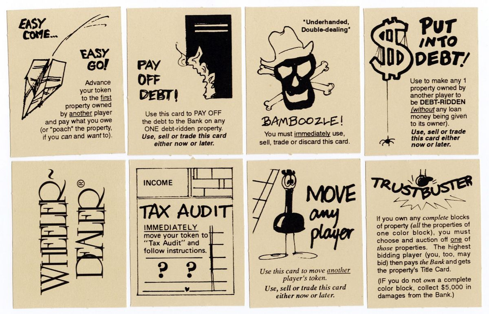
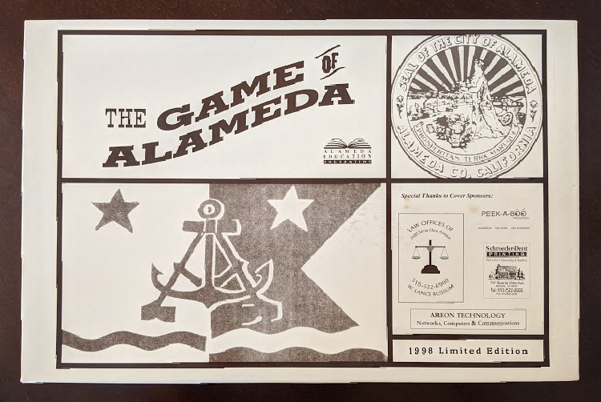
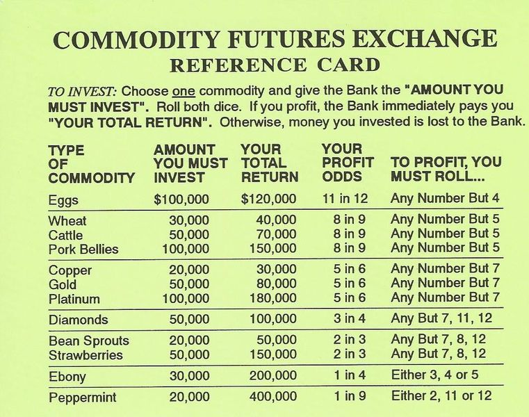
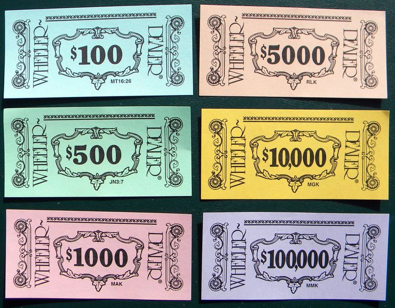

# Wheeler-Dealer game strategies
###### May 7, 2020

***

#### Table of Contents

[[toc]]

***

## History

Wheeler-Dealer is a Monopoly-style game (but notably _not_ Monopoly) produced by Michael Glenn Productions that was marketed in local areas during the 1980's and 90's and personalized for that area with the names of local businesses and retailers.^[https://boardgamegeek.com/boardgame/9433/wheeler-dealer]

Each production of the game was sold in its respective namesake city using the city's name in the title, typically in the format _The Game of \_\_\_\__. Like _The Game of Houston_, for example. Earlier productions of Wheeler-Dealer often applied the _-opoly_ suffix to the end of the name of the city: _The Game of Abbey-Opoly_, to name one.

From my research I've found that most productions of the game did not come in a box, rather the game board and all of the pieces and papers were shrinkwrapped together into a little bundle. This makes the games that did have custom boxes particularly collectable, as most still contain all of the original pieces and the branding was often very minimal and often very pleasing, as is the case with _The Game of Pacifica_, shown below.

Although these games haven't been produced for decades, many can be found available online for sale on Ebay or Etsy.

## Gameplay

Similar to Monopoly, the game features a number of property blocks and special tiles situated around the perimeter of the game board that players can purchase with money they've earned throughout the game. The goal of the Wheeler-Dealer is to either bankrupt your opponents, or finish the game with the highest total net worth. That's where the similarities end, however.

Unlike Monopoly, Wheeler-Dealer has no system of house or hotel ownership. There are also no railroads, no Chance cards, no Community Chest, no Free Parking, no Jail, no passing Go and no collecting $200. Wheeler-Dealer has its own unique set of rules, cards, and gameplay which make the game --- although very similar to Monopoly --- entirely unique, and admittedly a lot of fun, except of course if you draw a Tax Audit card.

Players begin each turn by first investing in the Commodity Futures Exchange --- kind of like a mini stock market --- where they must invest a set amount of money into one of twelve commodities, like Eggs, Wheat, Pork Bellies, Platinum, etc. Every commodity has a set  probability that a player will turn a profit (called the "profit odds") when investing in it.

After the player has chosen a commodity to invest in, they roll the dice, and either wins and receives a return on their investment, or loses their investment entirely. For example, copper requires an investment of $20,000, and as long as the player doesn't roll a seven (a 5 in 6 chance), they will get $30,000 from the bank (an extra $10,000 on top of their initial investment).

After investing in the Commodity Futures Exchange, the current player then rolls the dice to move their token --- like in Monopoly. Players then have the option to either buy the property or pay rent if it is owned, or leave the property up for auction.

At the end of each turn, players draw a Wheeler-Dealer card and must follow the instructions on the card. Some cards even force the player into an IRS Tax Audit, which give them a 50-50 chance of either winning between $10,000 and $60,000, or disastrously having to pay it to the bank instead.

If players have held on to one or more Wheeler-Dealer cards from previous turns (not all cards are required to be played immediately), they have the option to play just one additional Wheeler-Dealer card before ending their turn. There are a few strategies that make this minor mechanic very profitable, which will be discussed later.

The game only lasts about 50 turns, because the game ends after the player who drew the last of 50 Wheeler-Dealer cards ends their turn. This one simple concept adds a nice limit to the game, and games can be shortened by just removing Wheeler-Dealer cards from the deck --- this also adds an extra bit of mystery, as no one knows which Wheeler-Dealer cards have been removed.

At the end of the game, the winner is determined by total net worth, which is the sum of all of their cash on hand and property, minus and debts owed to the bank. Many games don't have a clear winner, making the final tally a nerve-wracking experience.

## The Game of Alameda

I discovered Wheeler-Dealer when I visited my city's local museum. When I was there, the museum was pretty much just a few disorganized rooms filled with chairs and a scattered artifacts resting on shelves and tables, but something in the corner caught my eye: a large faded white box atop a dresser. As I approached, I could make out the words on the top of the box. _The Game of Alameda_.

The box did not contain any other useful imagery to indicate what the game actually was about or how to play it, only some branding, the seal and flag of the City of Alameda, and a few sponsored logos and attributions. And of course the whole thing was wrapped in cellophane, so it wasn't even possible to open it up to see what was inside, only adding to the mystery.

The box did have one other thing though: a tiny white price tag stuck to the cellophane --- the kind you might see at a garage sale. It was 99¢.

The Game of Alameda, like other variants of Wheeler-Dealer, is a personalized version of the board game Wheeler-Dealer unique to the local area. The properties you can land on and purchase are those of local business and retailers that donated to help have the game licensed, like Sunny Beans Coffee Co., Sailnetics Computers, and John S. Towata Flowers. By the way, now that it's been 22 years since this game was produced, most of the businesses on the game board are no longer around, but there are a few!

I'm so glad we decided to purchase it. _The Game of Alameda_ has consistently been one of my favorite games, and has been a very contentious game between myself and my significant other.

## Strategies

Having played this game a number of times, I've discovered there are a few tricks and optimizations to help give one an edge when playing Wheeler-Dealer.

In this section I take a pretty deep dive into the math of the Commodity Futures Exchange, as well as discuss strategies for Wheeler-Dealer cards, using School to your advantage, and high-value property blocks.

Please note that the recommendations mentioned here may not --- and likely won't --- suit most versions of Whealer-Dealer, as each production is completely unique and older variants have drastically different rules with respect to the Commodity Futures Exchange. Also, all recommendations assume play at Level II.

### The Commodity Futures Exchange

The Commodity Futures Exchange is a really unique game concept. At the start of each turn, each player must invest in a commodity and will either turn a profit on their investment, or lose the investment entirely.

Interestingly, in earlier productions of the game, there were no compulsory investments for any commodity, only a max allowable investment. Returns on commodities were not a set amount, but rather determined by a payoff multiple which ranged somewhere between 1.2x and 30x depending on the commodity. These earlier productions arguably had a significantly more involved Commodity Futures Exchange --- some games were even packaged with cheat-sheet cards to help players determine what they've won.

Some commodities are more volatile than others. Peppermint is a great example of this; like copper it requires a $20,000 investment, however the odds of profiting are only 1 in 9. However, if the player rolls a 2, 11, or 12, they win and their total return is $400,000!

The game rules also allows players facing certain bankruptcy to make a last-ditch, hail-Mary investment on the Exchange. If the player manages to procure at least $20,000 in capital, they may make a one-time investment on the Commodity Futures Exchange for a chance at winning big and being able to settle their debts without having to resign the game.

The Commodity Futures Exchange is really quite an interesting game mechanic. It's hard to really say if it even adds anything to the game --- the profit odds are always constant, so there's bound to be certain commodities that are just simply always going to be better than others, so if all players invest in the same commodity, they all have the same odds of profiting. It's likely that the Exchange was a hold over from earlier productions of the games where, in those versions, there were a lot more variables at play making the game mecahnic far less predictable.

Despite this, it does add some spice to the game, not only does it allow players to accumulate more capital to invest in property or pay debts (if you make smart investments), it can also be devastating at times and can very quickly ruin a player if they're acting carelessly.

#### Investing smarter

Wanting to always play as efficiently as possible, I was curious as to which commodity offered the best average return on investment per turn. So, I did a little bit of math and constructed the following equation:

$$
A = \Big[P_\text{win} \times (R - I)\Big] - \Big[(1 - P_\text{win}) \times I\Big]
$$

Where:

$$
\begin{array}{ll}
  \\
  A &= \text{The average return per turn,}\\
  P_\text{win} &= \text{The probability of profiting from an investment,}\\
  R &= \text{The possible total return on investment,}\\
  I &= \text{The amount a player must invest}\\
\end{array}
$$

It's pretty simple really: it's just the odds of winning $P_\text{win}$ multiplied by amount the player would profit (the total return $R$ minus their investment $I$), subtracted by the odds of losing, multiplied by the amount the player would lose (their investment $I$). Basically: how much money the player would expect to win subtracted by how much money the player would expect to lose.

With this equation in mind, let's use the Commodity Futures Exchange table a few paragraphs up to calculate the average return on investment per turn for Diamonds, just as an exercise:

$$
\begin{array}{ll}
A &= \bigg[\frac{3}{4} \times (\$100,000 - \$50,000)\bigg] - \bigg[\Big(1 - \frac{3}{4}\Big) \times \$50,000\bigg]\\
\\
&= \bigg[\frac{3}{4} \times \$50,000\bigg] - \bigg[\frac{1}{4} \times \$50,000\bigg]\\
\\
&= \frac{\$150,000}{4} - \frac{\$50,000}{4}\\
\\
&= \frac{\$150,000 - \$50,000}{4}\\
\\
&= \frac{\$100,000}{4}\\
\\
&= \$25,000
\end{array}
$$

This means that on average, players should expect to profit $25,000 per turn when investing in Diamonds. That's a pretty good average rate of return, but is it the best option out there? What's the most statistically profitable commodity to invest in? Repeating this for all other eleven commodities, we find the following average returns:

$$
\begin{array}{l|r}
  \text{Eggs} & \$10,000\\
  \text{Wheat} & \$5,556\\
  \text{Cattle} & \$12,222\\
  \text{Pork Bellies} & \$33,333\\
  \text{Copper} & \$5,000\\
  \text{Gold} & \$16,667\\
  \text{Platinum} & \$50,000\\
  \text{Diamonds} & \$25,000\\
  \text{Bean Sprouts} & \$13,333\\
  \text{Strawberries} & \$50,000\\
  \text{Ebony} & \$20,000\\
  \text{Peppermint} & \$24,444\\
\end{array}
$$

You'll notice that **Strawberries** and **Platinum** both have the highest average rate of return per turn: $50,000. Without question these two commodities are the most consistent and reliable money makers. Interestingly, although these two commodities share the same average rate of return per turn, they have nothing else in common. So... which one is better? Are either fair game, or are there any subtle differences that make one more desirable than the other? Time to think about volatility.

Some commodities are riskier than others. Eggs, with it's steep $100,000 investment, only yields $20,000, but it's an incredibly safe investment having the highest profit odds of any other commodity at 11 in 12 (~92%). Peppermint on the other hand has an extremely small investment of $20,000, but yields a massive $400,000 return if the player is successful. However, the player only has a 1 in 9 (~11%) chance of success. Peppermint would therefore be easily considered riskier or more volatile investment than eggs --- you don't have to invest very much and most of the time you lose, but if you do win you win big.

Sure, the difference in volatility between two such extremes on the Exchange is easy to grasp. But how exactly can we measure subtler volatility, like that of Strawberries versus Platinum? Survey says: standard deviation. If we calculate the standard deviation of the expected profit per turn, then we'll be able to get a sense of which commodity --- Strawberries or Platinum --- is the better overall investment.

To calculate the standard deviation of the expected profit for each turn for a given commodity, we can use the following equation:

$$
\sqrt{\Big[P_\text{win} \times (R - I - A)^{2}\Big] + \Big[(1 - P_\text{win}) \times (-I - A)^{2}\Big]}
$$

Using the equation above, we can derive the following standard deviations of each commodity's expected return:

$$
\begin{array}{l|r}
  \text{Eggs} & \$33,166\\
  \text{Wheat} & \$12,571\\
  \text{Cattle} & \$21,999\\
  \text{Pork Bellies} & \$47,140\\
  \text{Copper} & \$11,180\\
  \text{Gold} & \$29,814\\
  \text{Platinum} & \$67,082\\
  \text{Diamonds} & \$43,301\\
  \text{Bean Sprouts} & \$23,570\\
  \text{Strawberries} & \$70,711\\
  \text{Ebony} & \$86,603\\
  \text{Peppermint} & \$125,708\\
\end{array}
$$

Looking again to Strawberries and Platinum, we now find that they have slightly different standard deviations. What exactly do these numbers mean though? Basically: **roughly 68% of players can expect their profit to fall within one standard deviation above or below the mean for any given turn.** This means that for players who invest in Strawberries, 68% of them would expect a return of between -$20,711 (16th percentile) and $120,711 (68th perecentile), whereas those who invest in Platinum would expect a return of between -$17,082 and $117,082.

The differences between Strawberries and Platinum are very slim, however, being that they both have the same average return per turn, it would be sensible to opt for the commodity with lower volatility --- even if only slightly.

My commodity of choice: **Platinum**.

### Wheeler-Dealer cards

### School

### Property
